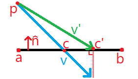

# Game Overview

## Core Concept
A 2D platforming-fighting game focused on fast-paced combat, technical movement, and flashy combos. Up to 4 players can brawl together with various characters across various stages. If you get hit, you might fly off the screen and lose a stock (a.k.a. life). Every time you get hit, it's a little easier to hit you farther next time. Lose all your stocks, and you're out!

## Genre
2D Fighter/Platformer

## Target Audience
We aim to appeal to fans of *Super Smash Bros. Melee* and *Rivals of Aether*.

## Platform(s)
For now, just PC

# Gameplay

## Core Gameplay Loop
Within a match, the players will attempt to take each other's stocks while preserving their own. A stock is lost by moving too far off-screen, which can be caused by a strong hit or simply falling below the stage and being unable to recover.

## Mechanics and Features

### Units
Unless otherwise stated, assume the following units:
- Distance is measured in in-engine units. These don't necessarily correspond with the pixels on the screen.
- Time is measured in frames, where 1 frame is equal to 1/60 seconds. The game updates once per frame.
- Velocity and speed are measured in distance per frame.
- Acceleration is measured in velocity per frame (distance per frame per frame).
- Angles are measures in degrees.

### Physical Attributes

#### Traction
When a character is grounded and their horizontal speed must change, it must abide by that character's traction coefficient. This number is a kind of acceleration and it describes the maximum amount that a character's horizontal speed can change per frame while grounded.

#### Air Control
Each character also has an air control coefficient, which is similar to traction except it applies when the character is airborne and not in hitstun.

#### Gravity
Each character has two numbers which describe gravity's influence over them:
- Gravity: The rate at which your character accelerates downwards.
- Maximum Fall Speed: Your maximum downwards veritcal velocity. This number does not apply when you're in hitstun from a spike move (see Knockback).

#### Weight
Every character has a unitless positive number which determines how easy they are to launch (see Knockback). This is their weight.

### Stage Collision
When a character's trajectory would go through a wall, their travel during that frame can't pass through the wall.

#### Stage Spike
If a character is travelling above a certain threshold speed (same for all characters) and they're in hitstun (see Hitstun), they experience a brief freeze-frame effect as they stick to the wall, then bounce away from the wall, preserving their initial speed. This is called a freeze frame, and it can be negated by a tech (see Tech).

#### Floor Collision
A special case where the player collides with a perfectly horizontal wall (a floor). If they're not in hitstun or tumble (see Hitstun and Tumble), they land normally. Otherwise, if they are going fast enough for a stage spike (see Stage Spike) they bounce, otherwise they go into knockdown (see Knockdown).

#### Platform Collision
A special sub-case of floor collision where the player is about to fall onto a platform (see Platforms). If the player is holding down on the control stick when they would collide with a platform and they're not in hitstun, they ignore the platform and fall through it.

#### Wall Collision Algorithm

Outlined below is an algorithm for detecting a wall collision and resolving the correct displacement along with a helper diagram.

On a given frame, a character has position $\mathbf{p}$ and velocity $\mathbf{v}$. In the way of their path, there is a wall defined by two points, $\mathbf{a}$ and $\mathbf{b}$. Let $\mathbf{\hat{n}}$ be the wall's unit normal, defined as:
$$\mathbf{\hat{n}}=\frac{1}{\|\mathbf{b}-\mathbf{a}\|}\cdot\begin{pmatrix}0 & -1\\ 1 & 0 \end{pmatrix}\cdot(\mathbf{b}-\mathbf{a})$$

Unless $\mathbf{v}\cdot\mathbf{\hat{n}}=0$ there must exist some point $\mathbf{c}$ which is on the line from $\mathbf{p}$ along $\mathbf{v}$:
$$\mathbf{c}=\mathbf{p}+\mathbf{v}\cdot t$$
where
$$t=-\frac{(\mathbf{p}-\mathbf{a})\cdot\mathbf{\hat{n}}}{\mathbf{v\cdot\mathbf{\hat{n}}}}$$
If $t$ is _not_ in the range $[0, 1]$ then there is no collision and we stop the algorithm here. Next we calculate $s$ such that $\mathbf{c}=\mathbf{a}+\mathbf{b}\cdot s$
$$s=(\mathbf{c}-\mathbf{a})\cdot(\mathbf{b}-\mathbf{a})$$
If $s$ is not in the range $[0, 1]$ then there is no collision. Otherwise we have found our collision point $\mathbf{c}$. The manner in which we use it next depends on whether we want the trajectory to end here (in the case of a stage spike) or if we want to "slide" along the wall (in the case of a non-bouncing collision). In the former case, we use $\mathbf{c}$ as the final position of the character for this frame. In the latter case, we have a bit more math to do to find $\mathbf{c'}$ as the final position (see diagram):
$$\mathbf{c'}=\mathbf{p}+\mathbf{v}-(1-t)(\mathbf{\hat{n}}\cdot\mathbf{v})\mathbf{\hat{n}}$$

### Damage (Percent)
Every damaging move in the game inflicts floating-point damage points called "percent" exactly like the _Super Smash Bros._ series. As a character gets hit, they accumulate percent and become easier to knock away (see Knockback below). When a character loses a stock (see Stocks) their percent resets to 0.

### Knockback
Most damaging moves inflict some amount of knockback which launches the target at a certain angle and speed. When a player receives knockback, their launch speed is a function of their own percent (see Percent), their weight, and the following two floating-point values from the move:
- Base knockback (BKB)
- Scaling knockback (SKB)

The speed at which a character gets launched uses the following formula:
$$ \text{Launch Speed} = \frac{1}{\text{Weight}} \times \left(\text{BKB} + \frac{\text{SKB} \times \text{Percent}}{100}\right) $$

#### Launch Angle
Knockback involves a launch angle which can be influenced by DI (see Directional Influence).

If a character is grounded and gets launched at non-upward angle, the result depends on the launch speed. If it is below a certain threshold value, they go into a special state of grounded hitstun (see Hitstun below). Otherwise, they are instead launched upward (angle flipped about the horizontal axis) at half speed. If the launch angle is perfectly horizontal, they should get launched one degree higher in order to avoid landing immediately.

Finally, an attack is considered a spike if it applies knockback at an angle that is within 12.5 degrees of perfectly downward. This forms a 45-degree cone of possible spike angles. Spikes involve special mechanical and visual effects which are specified elsewhere in this document.

#### Special Launch Angles
An instance of knockback may take on special launch angles which are treated differently from normal angles:
- Away: This type of launch doesn't have a fixed angle but instead launches the target directly away from the source of the knockback.
- Up and Away: This type of launch has a minimum angle of elevation which the target must be launched at. All straight-away angles from source to target are uniformly transformed such that an almost-straight-downward angle is transformed to the minimum angle of elevation. A perfectly-downward angle is converted into a perfectly-upward angle.

#### Hitstun
When you receive knockback, you receive an amount of hitstun proportional to your launch speed. This proportionality constant is the same across all characters. Your amount of hitstun is the number of frames before you are able to control your character again. The existence of hitstun is what allows multi-move combos to exist.

### Hitboxes
Players' body parts and attacking moves have hitboxes which let us detect overlap. The placement and size of each hitbox should (roughly) with the entity it's assigned to.

#### Shapes
Hitboxes can be circle- or pill-shaped. Any shape of hitbox can collide with any other shape.

#### Groups
Hitboxes are organized into groups which each have a unique ID.  Two hitbox groups are colliding if there exists at least one hitbox from each group such that those hitboxes overlap each other.

Once two hitbox groups collide, any subsequent collisions are ignored. This ensures that a player cannot be hit with the same instance of damage more than once if they collide for multiple frames. The two groups can begin colliding again after either one of them "refreshes." If either group is eventually removed, the other "forgets" the removed group's ID so it can collide with future groups if they happen to have that same ID.

#### Priority
Hitboxes can have a priority number which resolves ties when there are multiple possible collisions between two groups. Any hitboxes without a defined priority are considered to have the lowest priority. When there are multiple possible collisions, we prioritize the collision with the highest priority in either hitbox, breaking ties with the priority of the other hitbox in either collision. If this still results in a tie, prioritize the smallest-distance collision (see Hitbox Distance Algorithm).

#### Hitbox Distance Algorithm
Outlines below are the formulae for measuring distance between any two hitbox shapes. Two hitboxes are touching if the distance between them is 0, and the hitboxes overlap if their distance is negative.

##### Circle vs. Circle
Given two circular hitboxes with centres $\mathbf{c_a}, \mathbf{c_b}$ and radii $r_a, r_b$, their distance is equal to:
$$\| \mathbf{c_a} - \mathbf{c_b}\| - r_a - r_b $$

##### Circle vs. Pill
Given:
- A pill-shaped hitbox with endpoints $\mathbf{a}, \mathbf{b}$ and a radius $r_p$
- A circular hitbox with centre $\mathbf{c}$ and a radius $r_c$

We define three distance values: $d_a, d_b, d_p$. $d_a$ and $d_b$ are the distances from to $\mathbf{c}$ to $\mathbf{a}$ and $\mathbf{b}$ respectively:
$
\begin{align}
d_a &= \|\mathbf{a} - \mathbf{c}\| \notag \\
d_b &= \|\mathbf{b} - \mathbf{c}\| \notag
\end{align}
$
The third value $d_p$ is the perpendicular (i.e. shortest) distance from $\mathbf{c}$ to the line segment beteen $\mathbf{a}$ and $\mathbf{b}$, which we can compute:
$$d_p=\|c-a-\frac{b-a}{\|b-a\|}\cdot\left(\left(c-a\right)\cdot\left(c-a\right)\right)\|$$
The distance between the two hitboxes is $\min(d_a, d_b, d_p)-r_p-r_c$

##### Pill vs. Pill
To calculate the distance between two pill-shaped hitboxes, treat the endpoints of one hitbox as circles and resolve the minimum distance to the other hitbox. Then perform this same operation with the other hitbox and return the minimum between the four distances.

### Offensive Options
TODO

### Defensive Options

#### Shield
By holding the shield button while grounded, your character can surround themself with a defensive bubble. While this shield is active, it absorbs incoming damage and prevents your character from getting hit. Each character's shield has the same amount of hit points as well as the same rate of regeneration. After your shield's hit points are depleted, it breaks and completely stuns your character for 5 seconds, after which it comes back at half health. When you respawn you have full shield health.

When your shield gets hit but doesn't break, you experience "shield stun" where your shield remains up and you are completely unactionable for a small period of time. The amount of stun is proportional to the damage/knockback of the move which hit your shield.

Similarly to *Super Smash Bros. Ultimate*, you can execute a "perfect parry" by dropping the shield at roughly the same time that you get hit (up to a few frames before). When doing so, you experience no shield damage or shield stun, and you have a frame advantage over your opponent.

#### Spotdodge
By pressing down on the control stick and shielding at the same time while grounded, you sidestep or "spotdodge" and become completely invincible for a fixed amount of time. Every character has the same frame data for this move.

#### Roll
By pressing left or right on the control stick and shielding at the same time while grounded, you roll in the chosen direction while remaining invincible for part of the move. Every character moves the same distance and has the same I-frames. You cannot roll off of your current platform with this move; if you reach the edge then you will stay put.

#### Tech
If you're in hitstun and you collide with a wall above a certain speed, you can press the shield button just before collision to cancel all velocity and hitstun.

#### Directional Influence (DI)
When you are launched by an attach, you can hold a direction on the control stick and influence the direction at which you are launched. You cannot change the magnitude of the launch but you can change the angle by up to 15 degrees in either direction. The influence is greatest when your control stick angle is perpendicular to the launch angle.

#### Smash Directional Influence (SDI)
For every frame that you are in hitlag (not hitstun) you can hold a direction on the control stick and your character will move a small fixed distance in that direction. This can be used to achieve a wall tech, escape a multi-hit attack, or to slightly improve survival odds by increasing your distance from the blast zone.

### Movement Options

#### Walk
While grounded, each character can influence their horizontal speed by tilting the control stick to the left or right. The speed of the walk is determined by how far the stick is tilted, ranging from 0 to the character's maximum speed.

#### Dash
By quickly moving the control stick all the way to the left or right while grounded and idle, a character can break into a dash. A dash lasts for a set amount of frames and it propels the character forward at a constant speed (that character's dash speed). Before the dash ends, you may dash in the opposite direction and reset the dash "timer." By rapidly dashing back and forth, one can "dash-dance". If you let the control stick return to a neutral position.

#### Run
If you allow the "dash timer" to run out, your dash will become a run. During the run, your character will travel at their run speed, which may or may not be equal to their dash speed. If you try to dash in the opposite direction during a run, you'll turn slowly turn around and then continue running in the opposite direction.

#### Jump
Your character will briefly crouch down in a "jumpsquat" state then spring up with some positive vertical velocity, equal to that character's jump speed. If you let go of the jump button before your jumpsquat ends, you will execute a "short hop" which only rises half as high as your full jump.

#### Double Jump
While airborne, you may press the jump button to jump again and gain vertical velocity equal to your character's double-jump speed, which may or may not be equal to their normal jump speed. You cannot short hop this way because the jump happens instantly (no jumpsquat). Most characters can only double-jump once after they leave the ground, but some characters have a higher number of double-jumps before they need to land.

#### Wall Jump
While airborne and touching a vertical wall, you can tilt the control stick towards that wall and press the jump button to execute a wall jump, gaining vertical speed equal to your double jump speed and gaining horizontal speed away from the wall equal to your character's wall jump speed. Every character can only double-jump once before getting hit or landing.

#### Fast Fall
When you're airborne and moving downwards, you may tilt the control stick all the way down to temporarily double your maximum fall speed. Your maximum fall speed resets if you get hit or if are no longer moving downwards (for example, if you double jump or land on the ground).

#### Hit Fall
After hitting an opponent with a move while airborne, you may tilt the control stick all the way down, cancel all vertical speed, and immediately begin fast falling.

#### Airdodge
While airborne, you can press the shield button to cancel your velocity and execute an airdodge. During an airdodge, you are invincible and unaffected by gravity. An airdodge lasts for a set number of frames which is the same across all characters. You can only airdodge once before landing.

If you're holding a direction on the control stick while airdodging, you will glide in that direction during your airdodge. The distance of this glide is fixed and doesn't vary by character.

#### Waveland
This is a special movement option which is performed by airdodging into the ground, much like in _Super Smash Bros. Melee_ or _Rivals of Aether_. You land on the ground as normal, but you retain your horizontal velocity and slide along the ground as your traction slows you down. This move shouldn't need to get "implemented" during development because it exists as a consequence of the game's physics.

#### Wavedash
This is another special movement option where a character jumps off the ground and immediately wavelands. The player may airdodge during jumpsquat, meaning they do not need to wait until they actually leave the ground. Additionally, a wavedash may be executed by performing a grounded jump and an airdodge on the same frame.

#### Moonwalk
This movement option functions exactly as in _Rivals of Aether_. You may dash in one direction and then quickly move the control stick down and then to the other side in a semi-circular motion. Doing so in a set frame window (doesn't vary by character) will cause you to accelerate in the direction opposite to your original dash, up to your running speed in the opposite direction. As of now it is unclear whether the moonwalk should last indefinitely until you stop tilting the control stick.

## Controls
## Objectives
# Art and Sound
## Art Style
### Visual References/Inspiration
### Color Palette
### Character Designs
### Environment Aesthetics
## Sound
### Musical Style
### Themes/Motifs
### Sound Effects
# Level Design
## Level Structure and Flow
## Environmental Hazards/Obstacles
## Level Progression and Pacing
# User Interface
## Menus
### Main Menu
### Options Menu
### Character Select Menu
### Stage Select Menu
### Battle Modifiers Menu
## HUD (Heads-Up Display)
### Health Bars/Status Indicators
### Objective Markers
# Technical Requirements
## Game Engine
## Hardware Requirements
### Minimum System Specs
### Recommended System Specs
# Credits
This document is based on a template from the following site: https://www.gameindustrycareerguide.com/how-to-write-a-game-design-document/#example-gdd-outline